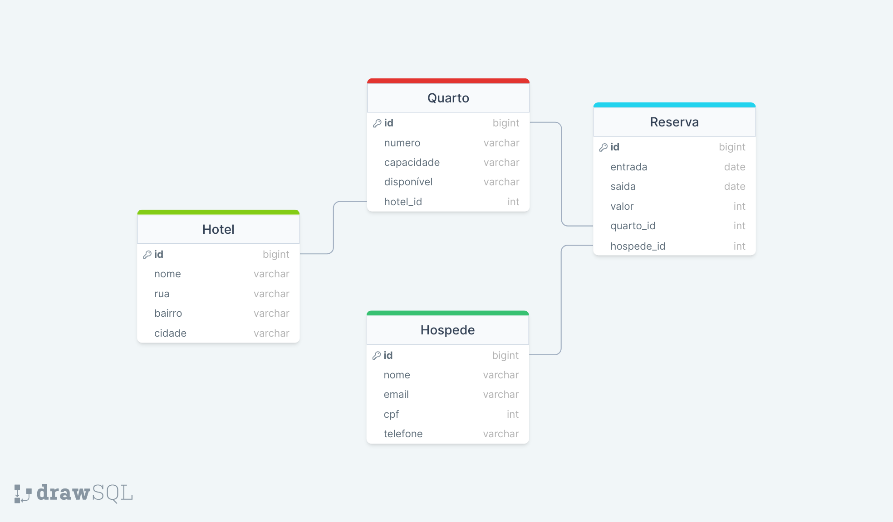

# Sistema de Reservas e Controle de Hospedagem - API

Este é um projeto simples que explora a implementação de uma API em um sistema de Reservas e Controle de Hospedagem. A solução permite a criação de hóspedes e hotéis, com funcionalidades completas para gerenciamento de quartos e reservas.

### O projeto inclui quatro tabelas no banco de dados:
  

### Foram utilizadas as seguintes tecnologias:
- Python
- Flask
- Psycopg2
- PostgreSQL
- Drawsql

Para mais informações do projeto, leia a documentação.
